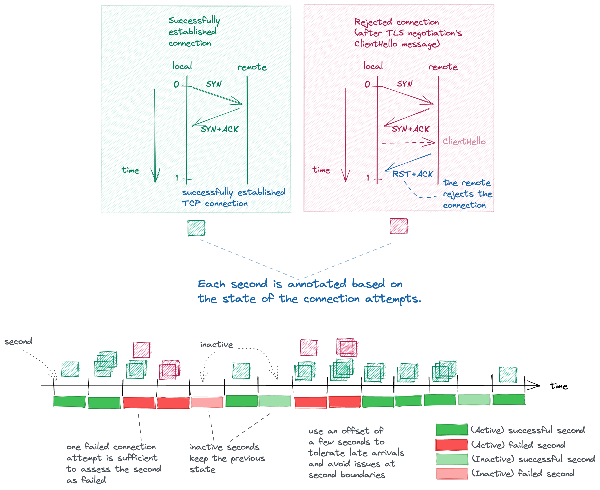

# Connectivity Exporter

[](https://reuse.software/)

Tracks the connectivity of a kubernetes cluster to its api server and exposes
_meaningful_ connectivity metrics. Inspired by the [meaningful availability][] paper and the
[SRE books][] by Google.

Uses [ebpf][] to observe all the TCP connection establishments from the shoot
cluster to the kubernetes api server.
Derives _meaningful_ connectivity metrics (upper bound for meaningful
availability) for the kubernetes api server that is running in the seed cluster.

## Understanding the Network Path


The network path from the shoot cluster to the api server.

The shoot cluster's api server is hosted in the seed cluster and the network
path involves several hops:

- the NAT gateway in the shoot cluster,
- the load balancer in the seed cluster,
- a k8s service hop and
- the envoy reverse proxy.

The reverse proxy terminates the TCP connection, starts the TLS negotiation and
chooses the api server of the shoot cluster based on the server name extension
in the TLS ClientHello message ([SNI][]).
The TLS negotiation is relayed to the chosen api server so that the client
actually establishes a TLS session directly with the api server.
(See [SNI GEP][] for details.)

## Identifying Failures

We can distinguish multiple failure types:

- There is no network connectivity to the api server.

  The focus of this connectivity-exporter component.

  New TCP connections to the kubernetes api server are observed to confirm that
  all the components along the network path to the kubernetes api server, and
  the kubernetes api server itself, are working as expected.
  Many things can break along the network path: the DNS resolution of the domain
  name of the load balancer, packets can be dropped due to misconfiguration of
  connection tracking tables, or the reverse proxy might be overloaded to accept
  any new connections.
  The mundane failure case that there are no running api server processes is
  also covered by the connectivity-exporter.

- The api server reports an internal server error.

  Detecting this failure type is not feasible for the connectivity-exporter
  component; it can be achieved by processing the access logs of the api server.

  The failure cases when the connection is successfully established, but the api
  server detects and returns a internal server failure (4xx - user error, 5xx -
  internal error) are considered as successful connection attempts, hence the
  connectivity-exporter yields an upper bound for meaningful availability.
  This situations can be detected on the server side, by parsing the access
  logs, knowing that due to the successful connections we can expect to find
  matching access logs.

- The api server doesn't comply with the specification.

  Detecting this failure type requires test cases with a known expected outcome.

  The most tricky failure case is when the api server can not itself detect the
  error and returns an incorrect answer as a success (2xx - ok).
  This failure case can only be detected by running test cases against the api
  server, where the result is known ahead of time and it can be asserted that
  the expected and actual results are equivalent.

## Annotating Time



The connectivity-exporter assesses each connection attempt based on the packet
sequence it observes in a certain time window:

- rejected connection:
  `SYN` packet sent, `SYN+ACK` packet received, but e.g. during the TLS
  negotiation the server responds with an `RST+ACK` packet to abort the
  connection

- successful connection:
  `SYN` (packet sent to the api server), `SYN+ACK` (packet received from the api
  server)

The connectivity exporter annotates `1s` long time buckets after a certain
offset, to tolerate late arrivals and avoid issues at second boundaries:

- active (/inactive) second:
  active if there were some new connection attempts,
  inactive if there were no new connection attempts,

- failed (/successful) second:
  failed if there was at least one failed connection attempt (rejected), or
  if there were no connection attempts and the preceding bucket was assessed as
  failed;
  successful otherwise.

## Exposing Prometheus Metrics

The state of the connectivity exporter is exposed with prometheus counter
metrics, which can be comfortably scraped without losing the 1s granularity.

```prometheus
# HELP connectivity_exporter_connections_total Total number of new connections.
# TYPE connectivity_exporter_connections_total counter
connectivity_exporter_connections_total{kind="rejected"} 0
connectivity_exporter_connections_total{kind="successful"} 544

# HELP connectivity_exporter_seconds_total Total number of seconds.
# TYPE connectivity_exporter_seconds_total counter
connectivity_exporter_seconds_total{kind="active"} 337
connectivity_exporter_seconds_total{kind="active_failed"} 0
connectivity_exporter_seconds_total{kind="failed"} 0
```

When the connectivity exporter is deployed in the seed, an SNI label is added to
the metrics above to differentiate the connections to the different api servers.

### What makes these metrics meaningful?

The failed seconds counter metric is meaningful because _it captures what users experience_.
In every counted failed second, there was at least one failed connection attempt
by a user or there weren't any successful connection attempts since the last
failure.
During the uptime of the monitoring stack itself, any failed connection attempt
by a user will be reported as a failed second.

## Visualizing the Data

We can visualize the data in a Grafana Dashboard showing the uptime of
specific SNI. With this data, we can easily calculate the remaining error
budget of a cluster with a 1s granularity.


[ebpf]: https://ebpf.io/
[SNI]: https://en.wikipedia.org/wiki/Server_Name_Indication
[SNI GEP]: https://github.com/gardener/gardener/blob/master/docs/proposals/08-shoot-apiserver-via-sni.md
[Gardener]: https://gardener.cloud/
[meaningful availability]: https://www.usenix.org/conference/nsdi20/presentation/hauer
[SRE books]: https://sre.google/books/
