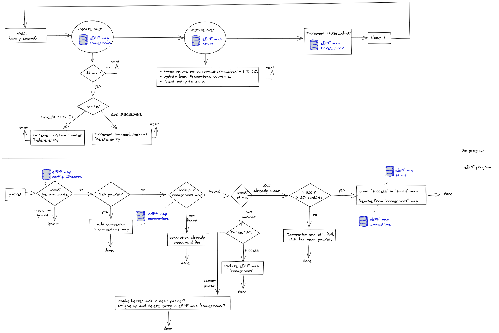

# New eBPF architecture for connectivity-monitor



## Map `config_ips`

This map is for configuring the set of IPs that should be watched.
The user could choose to select one IP or several endpoints if the load
balancer is backed by several IPs.

The user might want to watch all connections regardless of the IP (`*`
semantics).
For this reason, the map is actually a longest prefix match (LPM) map
containing CIDRs so that 0.0.0.0/0 could encode the `*`.

This map is initialized by the Go program based on the configuration passed in
the command line arguments.

The Go program might perform regular DNS queries if it's been fed with DNS
names rather than IP addresses.

The eBPF program reads the map without performing modifications.

| Name       | `config_ips`                                      |
| ---------- | ------------------------------------------------- |
| Map type   | `BPF_MAP_TYPE_LPM_TRIE`                           |
| Map keys   | `struct bpf_lpm_trie_key {u32 prefixlen, u32 ip}` |
| Map values | dummy                                             |

## Map `config_ports`

On Gardener, the api servers might listen on both 443 and 8443.

Similarly to `config_ips`, this map is initialized by the Go program and the
eBPF program reads the map without performing modifications.

| Name       | `config_ports`       |
| ---------- | -------------------- |
| Map type   | `BPF_MAP_TYPE_HASH`  |
| Map keys   | port (u16)           |
| Map values | dummy                |

**Task:** Parse PROXY protocol

## Map `connections`

This map is used for keeping TCP connection state across eBPF program
invocations.

When a new `sk_buff` is received, the eBPF program parses the packet to find
out  the connection tuple and uses the tuple to perform a lookup against this
map to see if the packet is part of an already-tracked connection.
The map is updated as well.

| Name       | `connections`         |
| ---------- | --------------------- |
| Map type   | `BPF_MAP_TYPE_HASH`   |
| Map keys   | `struct tuple_key_t`  |
| Map values | `struct tuple_data_t` |

```
struct tuple_key_t {
    source_ip
    dest_ip
    source_port
    dest_port
}

struct tuple_data_t {
    state (enum: {
        SYN_RECEIVED,
        SYNACK_RECEIVED,
        SNI_RECEIVED,
        RST_SENT_BY_CLIENT,
        RST_SENT_BY_SERVER,
        FIN_RECEIVED
    })
    SNI (string)
    byte position (u32)
    parsing_context (TBD)
    timestamp_first_packet
    ticker_clock_first_packet (see next maps)
}
```

This map is left empty during initialization.
It is updated by the eBPF program whenever a packet is received.

**Task:** support IP fragmentation with the byte position

In case of IP fragmentation, if the SNI data is not in the first packet, we
could add parsing context data in the values.

**Task:** dormant connection counter & garbage collection

Since the eBPF program is only called upon reception of a packet, all garbage
collection or actions based on timeouts are performed from the Go program.

Additionally, the eBPF program cannot iterate over the entries from the
connections map to garbage collect because:

* Linux only has BPF helper functions to do lookups in the map but nothing to
  iterate.
* That would be a loop forbidden by the verifier.
* The eBPF program could be executed by several CPUs in parallel, so that
  would require additional synchronization.

Therefore, the Go program iterates every second over the map and removes each
connection that's older than 20 seconds and doesn't have SNI information.
The Go program also increases its "dormant connection" counter in such a case.

## Map `ticker_clock`

Since we cannot implement tickers or timeouts in eBPF programs, anything that
needs tickers or timeouts should be initiated from the Go program.

eBPF programs can get timestamps with `bpf_ktime_get_ns()`, returning the same
value as the call `clock_gettime(CLOCK_MONOTONIC)` in userspace.
However, it is not easy to correlate the timestamp with the wall clock
(`CLOCK_REALTIME`).

In order to avoid these limitations, we use the `ticker_clock` map to hold a
single u64 incremented every second from userspace.
The eBPF program can then use this value modulo 20 to figure out the index of
the `sni_stats` map in which information should be stored.

There are advantages to changing this value from userspace only:

* We can ensure that the clock does not increment while the Go program scrapes
  the eBPF maps.
  Since iterating over the eBPF maps is not atomic, we need this to avoid a
  race condition.
* Before incrementing the counter, the Go program can clean up old values in
  other maps (see maps below).

| Name       | `ticker_clock`                        |
| ---------- | ------------------------------------- |
| Map type   | `BPF_MAP_TYPE_ARRAY` (size 1)         |
| Map keys   | Index (u32)                           |
| Map values | counter (u64)                         |
| Updated by | Ticker in Go program: increment index |
| Read by    | eBPF program (and apply modulo 20)    |

## Map `stats`

| Name           | `stats`                                                  |
| -------------- | -------------------------------------------------------- |
| Map type       | `BPF_MAP_TYPE_HASH_OF_MAPS` (map containing other maps)  |
| Map keys       | SNI (string)                                             |
| Map values     | Map `sni_stats` described below                          |
| Initialized by | Go program with the set of SNI to watch                  |

New maps cannot be created from eBPF programs, so adding a new entry in a map
of map can only be done from userspace (unless we keep a pool of empty maps
that can be reassigned dynamically in the eBPF program, but I would like to
avoid those complications).
Therefore, the map of maps is populated from the Go program at initialization.

**Task (if desired):** dynamic allocation of inner maps from the eBPF program.

## Map `sni_stats` (inner map of `stats`)

Each instance of this map contains the statistics for one SNI.

The array has 20 entries because we want to keep information about the last 20
seconds.

| Name       | `sni_stats`                    |
| ---------- | ------------------------------ |
| Map type   | `BPF_MAP_TYPE_ARRAY` (size 20) |
| Map keys   | Index (u32)                    |
| Map values | `struct sni_stats_t`           |

```
struct sni_stats_t {
    u64 succeeded_connections
    u64 failed_connections
}
```

When the eBPF program parses an RST packet for an existing connection with a
known SNI, the program needs to increment the `failed_connections` counter at the
correct index.
We have two implementation choices:.

* Increment the `failed_connections` counter at the "now" index, as specified in
  the `ticker_clock` map.
  In this case, there is a 20-second delay before the event is recorded in the
  Prometheus graphs but the event is synchronized with the events about
  successful connections.
* Increment the `failed_connections` counter at the index
  `ticker_clock_first_packet` as specified in the "connections" map for that
  connection.
  In that case, the event is reported sooner, but the "failed" graph isn't
  synchronized with the "success" graph.
  Additionally, we need to ensure that RST packets from long-running connections
  (older than 20 seconds) don't corrupt data.

When the eBPF program parses a FIN packet for an existing connection with known
SNI, it increments the `succeeded_connections` counter.

## Flow: the scrapper Goroutine

In an infinite loop:

* Iterate on the `connections` map to find **old** connections:

  * Old means: `current_ticker_clock - ticker_clock_first_packet > 20`
  * Remove old connections **using batch operations**.
  * If the connection was in `SYN_RECEIVED` or `SYNACK_RECEIVED` state,
    increment the dormant connection counter.
  * If the connection was in `SNI_RECEIVED` state, increment the local
    `succeeded_connections` counter for that SNI.

* Iterate on the "stats" map:

  * Fetch and reset to zero the cell in the array at index `current_ticker_clock + 1 % 20`.
  * The fetched values are used to update the local Prometheus counters.

* Increment the `ticker_clock` map.
* Sleep for 1 second.

## Metric: `succeeded_seconds`

The `succeeded_seconds` metric can be incremented in two different ways (two
different code paths):

1. The connection has SNI information and 20 seconds have passed since the
   arrival  of the first packet.
   In this case, the metric is incremented from the Goroutine without going
   through the `stats` map.

2. The connection has SNI information and the eBPF program decided it was a
   successful connection due to one of the following reasons:

   1. The eBPF program counted >1kB of data on that connection
   2. The eBPF program counted >30 packets on that connection
   3. The eBPF program noticed a FIN packet on that connection

   In all of those cases, the metric goes through the `stats` map and the
   connection is deleted from the `connections` map.

## Metric: `failed_seconds`

The `failed_seconds` metric is incremented when the eBPF program parses an RST
packet for an existing connection with a known SNI.
